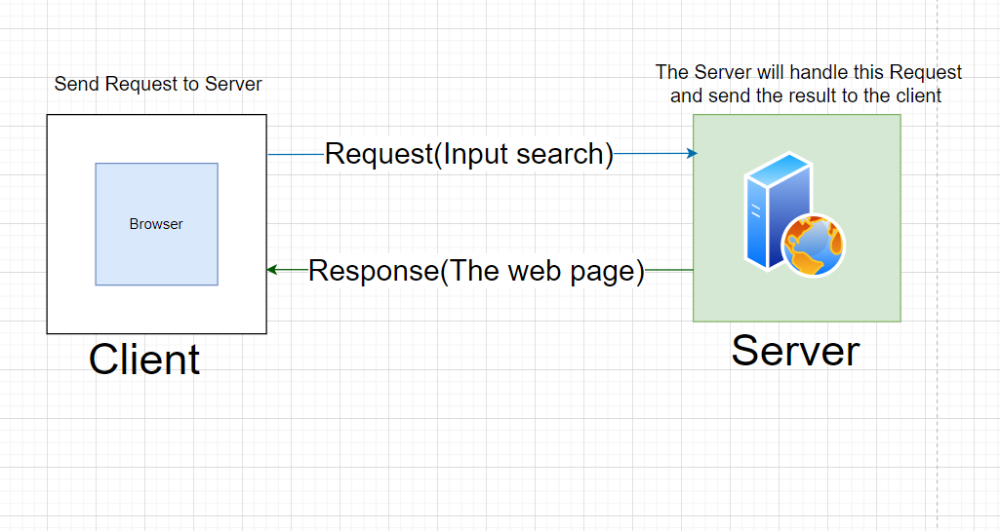
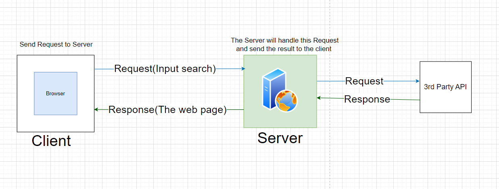
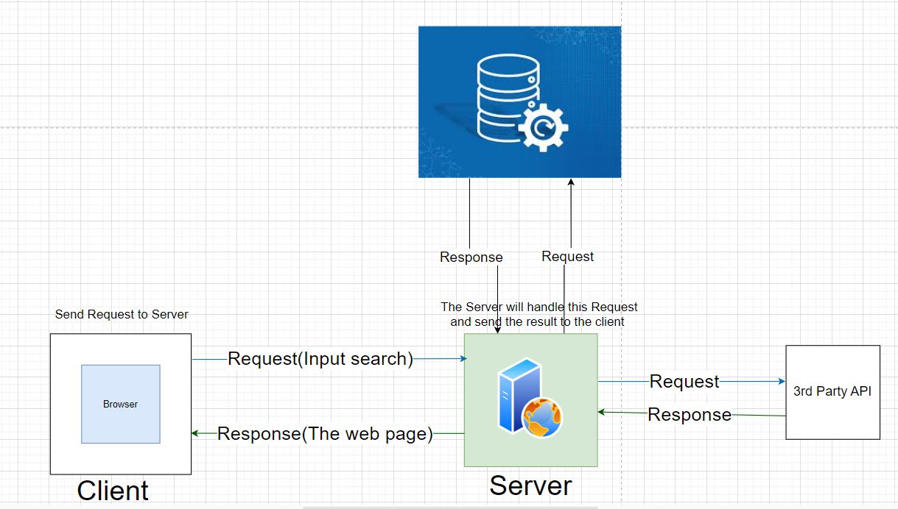

# Movies-Library

**Author Name**: Hassan Ayman 

## WRRC
**Image of WRRC** :

## Overview
When the client does a search in the browser, like when they want to search for an image, they press 'Enter', and the browser sends this HTTP request to the server, containing the value. The server will take this request and handle it within the whole database. Once the server retrieves the image from the database, it sends an HTTP response back that contains the image, rendering this image in the browser and displaying it to the client.

## Getting Started
<!-- What are the steps that a user must take in order to build this app on their own machine and get it running? -->
1. Install the package for the **Node JS**.
2. Create the repo in **GitHub** and clone it: `git clone <URL_repo>`.
3. Initialize a new Node.js project using npm `npm init -y`.
3. Create file for the application `sever.js`. 
4. Install the Express package `npm install express cors`.
5. Run file Node.js application `node server.js`.

## Project Features
<!-- What are the features included in you app -->
1. Require the **Express** `const express = require('express');`.
2. Use the routes like **GET** method `app.get("/favorite", handelFavorite);`.
3. Error handling `res.status(404).send('Page Not Found');`
4. Listen Server to start: `app.listen(port, () => {console.log(port)});`

## Getting Started with 3rd Party API 
1. Node Express Server
2. Use axios to fetch remote data asynchronously
3. Get data from a 3rd Party API

## WRRC
**Image of WRRC** :

## Lab13
## Getting Started with DB 
1. Node Express Server
2. CRUD operation
3. Post data to DB and get data from DB

## WRRC
**Image of WRRC** :

